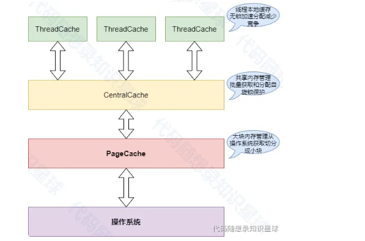

# MemoryPool

ThreadCache(线程本地缓存)
* 每个线程独立的内存缓存
* 无锁操作，快速分配和释放
* 减少线程间竞争，提高并发性能
CentralCache(中心缓存)
* 管理多个线程共享的内存块
* 通过自旋锁保护，确保线程安全
* 批量从PageCache获取内存，分配给ThreadCache
PageCache(页缓存)
* 从操作系统获取大块内存
* 将大块内存切分成小块，供CentralCache使用
* 负责内存的回收和再利用